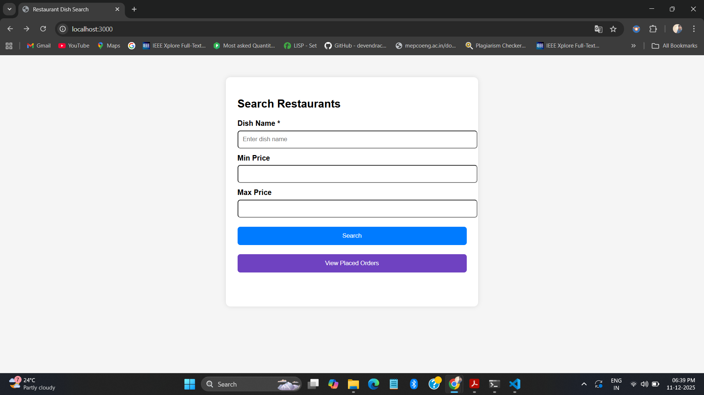
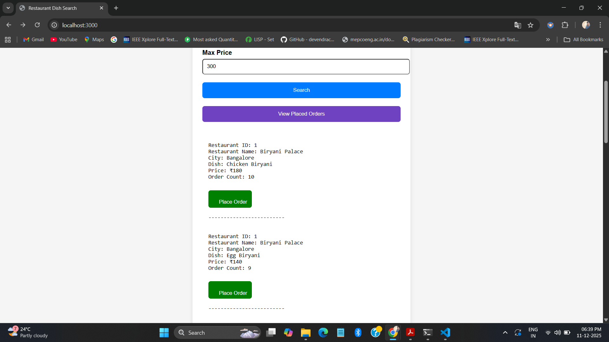
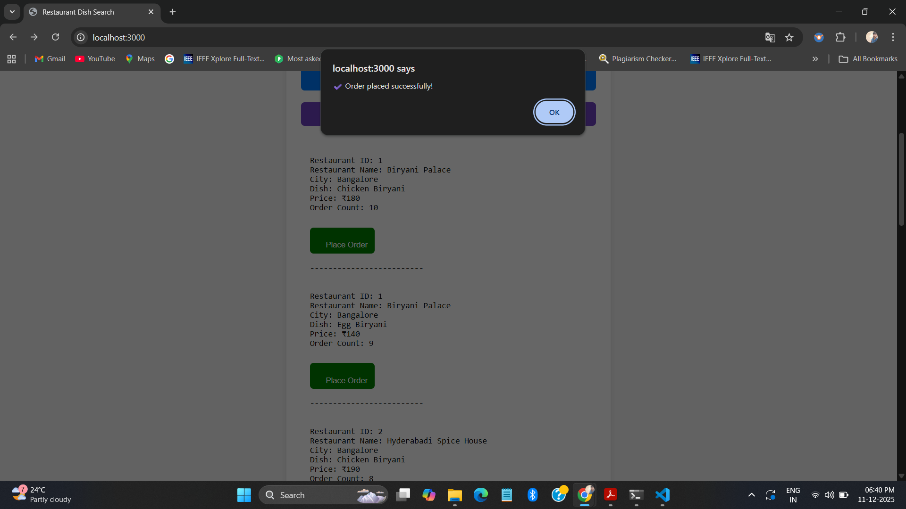
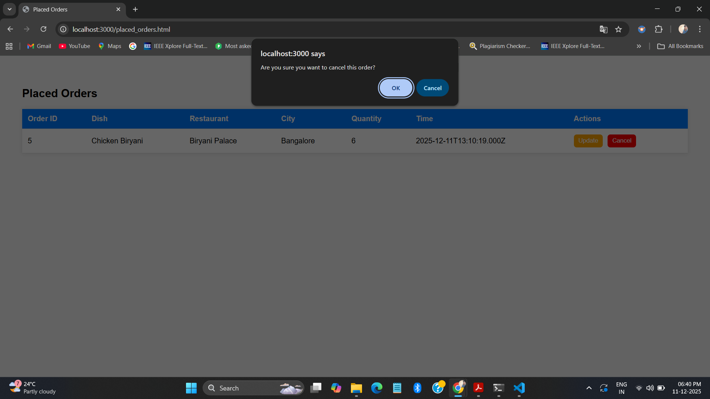
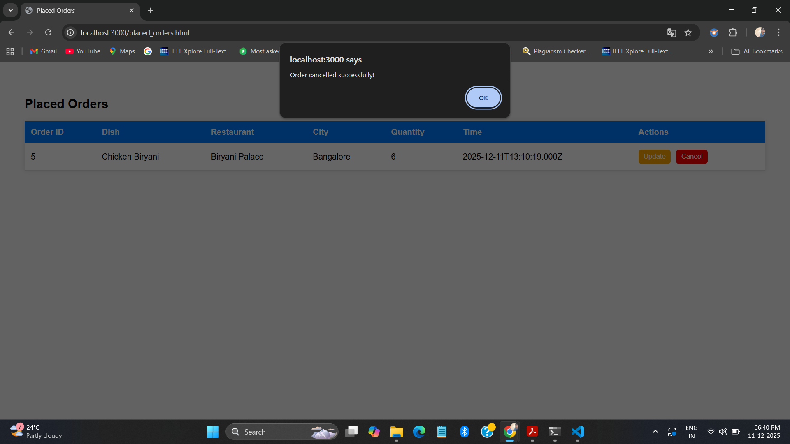
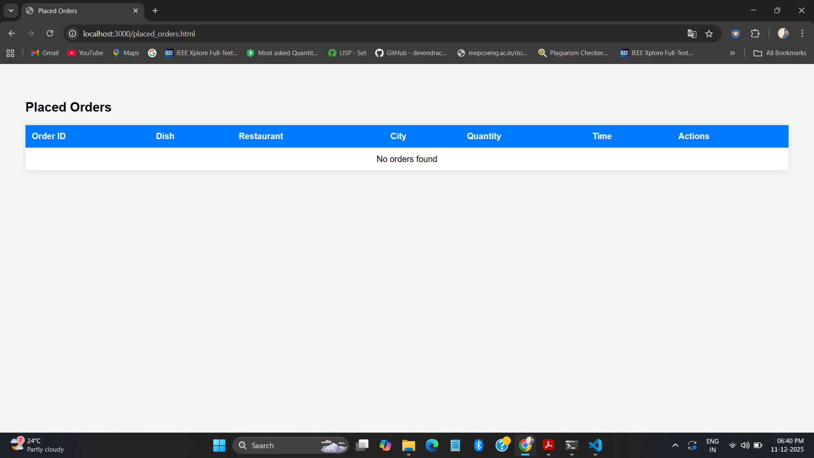
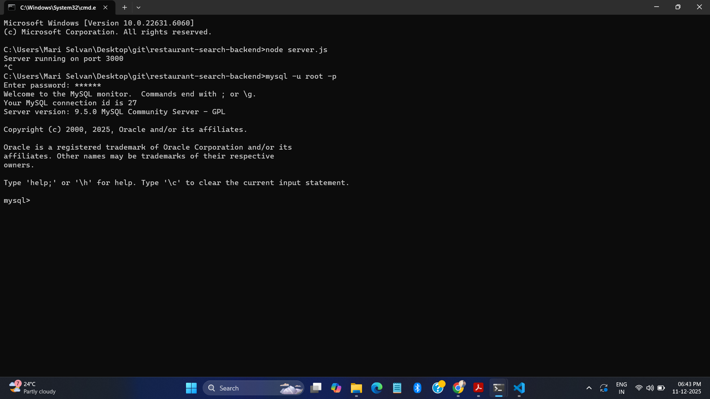
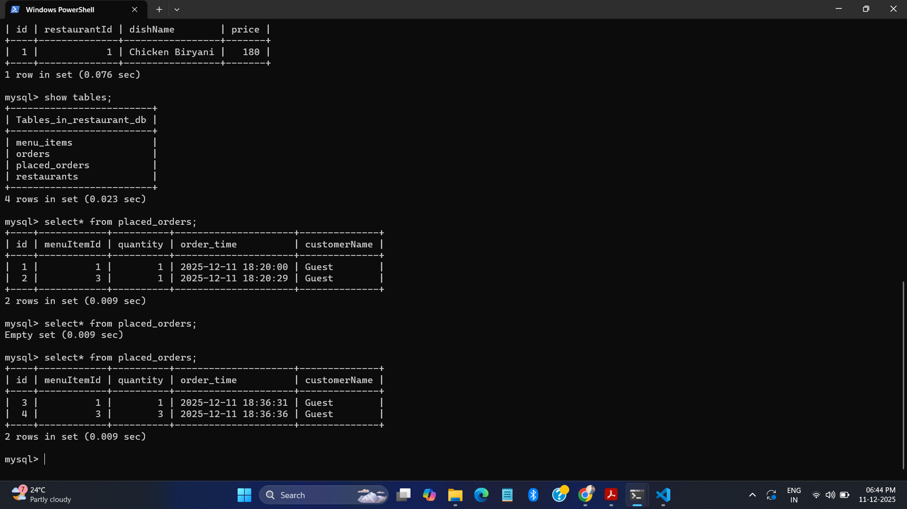
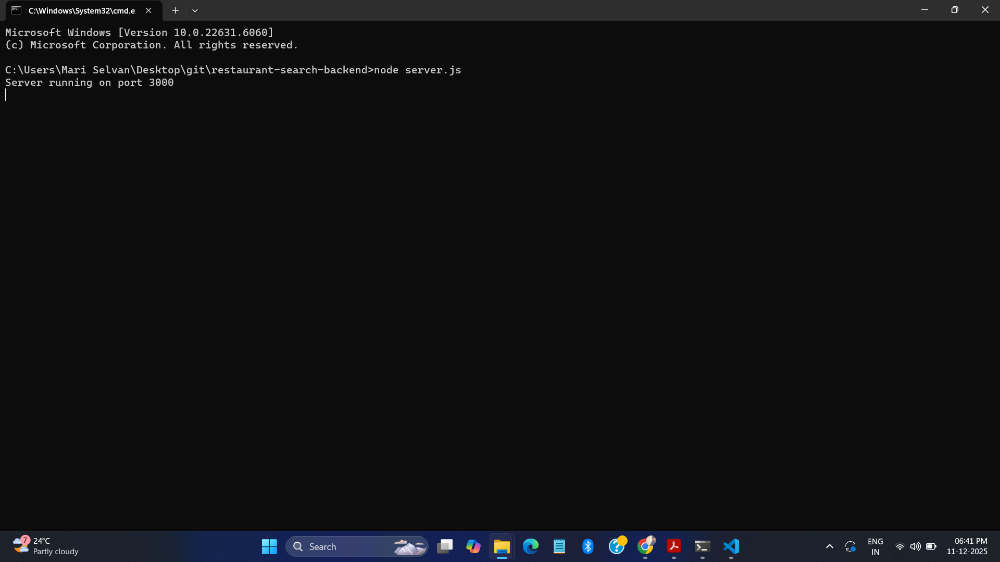

# 🍽️ Restaurant Search & Order Management API  
A Node.js + MySQL backend application that allows users to search restaurants by dish name, price range, and also place & manage food orders.  
Includes a simple HTML frontend for interacting with the API.

---

## 🚀 Features

### 🔍 Search Module
- Search restaurants by dish name  
- Filter by minimum and maximum price  
- Shows:
  - Restaurant name  
  - City  
  - Dish name  
  - Price  
  - Total orders  

### 🛒 Order Module
- Place new food orders  
- View all placed orders  
- Update order quantity  
- Cancel orders  
- Order history with:
  - Dish details  
  - Restaurant details  
  - Quantity  
  - Timestamp  

### 🖥️ Frontend UI
- `index.html` — Search restaurants & place orders  
- `placed_orders.html` — View, update, cancel orders  

---

## 🛠️ Tech Stack

| Layer | Technology |
|-------|------------|
| Backend | Node.js, Express.js |
| Database | MySQL |
| Frontend | HTML, CSS, JavaScript |
| Hosting Options | Render / Railway / GitHub Pages |

---

## 📁 Project Folder Structure
restaurant-search-backend/
│
├── controllers/
│ ├── searchController.js
│ └── placedOrderController.js
│
├── routes/
│ ├── search.js
│ └── placedOrderRoutes.js
│
├── public/
│ ├── index.html
│ └── placed_orders.html
│
├── db.js
├── server.js
├── seed.sql
├── package.json
└── README.md

Screenshots Section
## 📸 Screenshots

### 🔵 Search Page

### After Search Results

### 🟢 Order Success

### 🟡 Update Quantity

### 🔴 Cancel Order

### Cancel Success

### 🟣 Placed Orders - First Page

### Placed Orders - Main Page

### 🗄️ Database Login

### Database After Login

### MySQL Tables

### MySQL Values After Update

### 🖥️ Server Starting

### Server Running

### ❗ Error - No Data

